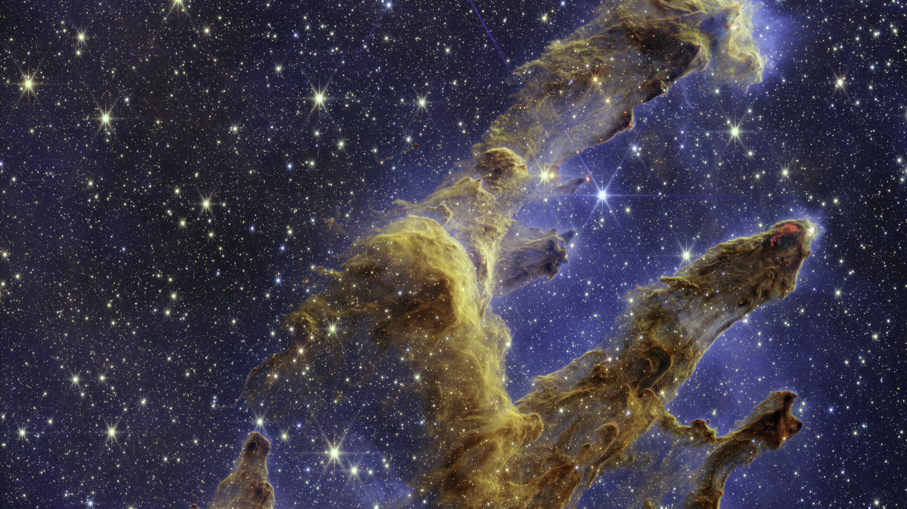

# Exoplanet Exploratory Data Analysis (EDA)

## Overview

This project explores a dataset of exoplanets with a focus on understanding their habitability, planetary characteristics, and the methods used for their discovery. The analysis involves data cleaning, feature engineering, and visualization to draw insights about exoplanets and their potential for supporting life.\
[GoogleColab](https://colab.research.google.com/drive/1fHOAc_JCGSP-ko8APdE92E-1pFnAHGH0?usp=sharing)

## Contents

- **Exploratory Data Analysis (EDA)**: Focus on habitability, planetary characteristics, and discovery trends.
- **Data Cleaning**: Handling missing values, converting data types, and feature selection/reduction.
- **Feature Engineering**: Creating new features related to luminosity, density, surface gravity, habitability, and more.
- **Findings**: Key insights into habitability, planetary characteristics, and discovery trends.

## Data Cleaning

1. **Flag Columns**: Filled missing values in flag columns (indicating data limitations) with 0.
2. **Numerical Data**: Imputed missing numerical values using the median (minimal skewness).
3. **Categorical Data**: Filled missing values in the 'st_metratio' (stellar metallicity ratio) column with the mode.
4. **Data Type Conversion**: Converted flag columns, planet mass/radius providers, discovery methods, and facilities to categorical data types.
5. **Feature Selection/Reduction**: Dropped unnecessary or redundant columns (e.g., flag columns, RA/Dec in sexagesimal format, error values, redundant mass/radius columns).

## Feature Engineering

1. **Luminosity**: Calculated the luminosity of the star using its radius and effective temperature, normalized to solar luminosity.
2. **Density**: Computed the density of exoplanets, normalized to Earth's density.
3. **Surface Gravity**: Calculated the surface gravity of stars, normalized to solar surface gravity.
4. **Orbital Period**: Converted orbital periods to years.
5. **Effective Temperature to Radius Ratio**: Computed the ratio for each star.
6. **Years Since Discovery**: Added a column indicating the number of years since discovery.
7. **Habitability Features**: Created boolean features indicating 'habitable', 'liquid_water_possibility', 'Earth_like', 'sun_like_star', and 'Earth_like_density'.

## Exploratory Data Analysis (EDA) Findings

### 1. **Habitability**:

- Analyzed potential habitable exoplanets based on insolation flux, planet temperature, and size.
- Identified 86 exoplanets within the habitable zone based on Earth-like radius and liquid water potential.
- Refined criteria to include orbital stability (low eccentricity), sun-like stars, and Earth-like density.
- Top 3 potential candidates for habitability: **Kepler-1410 b**, **Kepler-1544 b**, and **Kepler-452 b**.

### 2. **Planetary Characteristics**:

- Examined relationships between mass, radius, density, and orbital properties.
- Visualized the correlations to gain insights into how these factors influence exoplanets.

### 3. **Exoplanet Discovery Trends**:

- Analyzed the trend of exoplanet discoveries over time, with a notable increase in discoveries in the last 12 years.
- Most exoplanets were discovered in recent years due to advancements in technology.
- **Kepler** led the discoveries, accounting for around 50% of all exoplanets in the dataset.

## File: `exoplanets.txt`

The `exoplanets.txt` file contains the variable definitions used in the dataset, including descriptions for each of the columns. It provides clarity on the meaning and units of the features analyzed in the project.

## Conclusion

This EDA provides insights into exoplanets' potential for habitability, their characteristics, and trends in their discovery. The analysis leverages powerful data cleaning, feature engineering, and visualization techniques to uncover patterns that can inform future research in exoplanet exploration.

---

### Technologies Used

- Numpy
- Python
- Pandas
- Plotly
- Seaborn
- Scipy

### License

This project is licensed under the MIT License.
